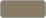

# mapcoopa

`mapcoopa` is a header-only C++ world generator: a seed and a `MapConfig` in, a whole
`MapGraph` out — Voronoi cells carrying an elevation, a climate and one of 33 biomes,
threaded with rivers that run downhill to the sea and a road network routed between the
places worth travelling between — graded highway, road and trail by the traffic each
stretch carries, bridging the rivers it crosses; nations divided into provinces whose
borders settle on ridgelines and coasts; settlements
placed where people would actually live, each with a population counted from its buildings
and a name in its region's own invented language; and landmarks read off the terrain
itself. It is a port of Amit Patel's *Polygonal Map Generation*
([Red Blob Games](https://www.redblobgames.com/maps/mapgen2/)).

It produces **data**, not pixels: nothing here touches Vulkan, GLFW or any sibling repo
other than [`libcoopa`](../libcoopa), which it uses for exactly two headers
(`coopa/collections/yaml_map.h` and `coopa/debug/logger.h`). The two PNG renderers are a
software-only debugging convenience; the deliverable is the `MapGraph`, and
`coopa/maps/map_yaml.h` writes one to disk so a game can load a world it did not generate.

Everything is reproducible: a `MapConfig` plus its `seed` fully determines the output,
byte for byte, including the settlements and the wobble on every coastline.

Full module documentation, the data-flow diagram and a usage example live in
[**`coopa/maps/README.md`**](./coopa/maps/README.md); the twelve generation stages are
documented in [`coopa/maps/passes/README.md`](./coopa/maps/passes/README.md).

---

## Generating a map

`cbuild` configures and builds; `cplay` runs `./build/mapcoopa` — the generator — and
forwards its arguments verbatim.

```bash
cd libs/mapcoopa
cbuild
cplay --seed=42 --out=world
```

That writes `world_biomes.png`, `world_elevation.png` and `world.yaml` into the current
directory. With no `--seed` the generator draws one from system entropy and prints it, so
every run differs but stays reproducible afterwards.

`cbuild` wipes `build/` and reconfigures every time. For a fast iteration loop after the
first build:

```bash
cmake --build build && ./build/mapcoopa --out=world
```

### Options

| Flag | Default | Effect |
|---|---|---|
| `--seed=N` | random, printed | Master seed; reproduces a map exactly |
| `--grid-size=N` | 80 | Cells per axis. The island noise frequency scales with this, so a bigger map resolves more finely instead of fragmenting |
| `--image-size=N` | 2048 | Render size in pixels, square |
| `--rivers=N` | 55 | River sources to attempt |
| `--towns=N` | 28 | Settlements to place |
| `--road-hubs=N` | 32 | Places the road network is routed between |
| `--countries=N` | 5 | Nations to carve out |
| `--regions=N` | 3 | Provinces per nation |
| `--no-regions` | — | Skip political geography entirely |
| `--no-landmarks` | — | Skip notable places |
| `--no-roads` | — | Skip the road network |
| `--no-subdivide` | — | Straight cell boundaries instead of wobbled ones |
| `--out=PATH` | `map_out` | Output prefix |

At the default `--grid-size=80` the YAML lands around 15 MB.

## Legend

### Biomes

The colours `BiomeRenderer` fills a cell with, from `BiomePalette::biome_colors` in
[`coopa/maps/map_config.h`](./coopa/maps/map_config.h). The **name** column is the
`snake_case` identifier written into the `.yaml` and accepted back by `biome_from_name()`
— that string is a biome's stable on-disk identity, so it is what to key on rather than
the enum's position. The swatches are SVGs under [`docs/legend/`](./docs/legend), one per
palette entry; `test_readme_legend_matches_the_palette` fails the build if any hex here
drifts from `BiomePalette`.

| Colour | Biome | YAML name | Hex | RGB |
|---|---|---|---|---|
|  | Ocean | `ocean` | `#5EB6DF` | 94, 182, 223 |
|  | Lake | `lake` | `#5EB6DF` | 94, 182, 223 |
|  | Marsh | `marsh` | `#215E21` | 33, 94, 33 |
|  | Ice | `ice` | `#D2FFFC` | 210, 255, 252 |
|  | Beach | `beach` | `#F5DEB3` | 245, 222, 179 |
|  | Snow | `snow` | `#FFFAFA` | 255, 250, 250 |
|  | Tundra | `tundra` | `#A9A9A9` | 169, 169, 169 |
|  | Bare | `bare` | `#C9B49B` | 201, 180, 155 |
|  | Scorched | `scorched` | `#99826D` | 153, 130, 109 |
|  | Taiga | `taiga` | `#336600` | 51, 102, 0 |
|  | Shrubland | `shrubland` | `#808000` | 128, 128, 0 |
|  | Temperate desert | `temperate_desert` | `#EED6AF` | 238, 214, 175 |
|  | Temperate rain forest | `temperate_rain_forest` | `#556B2F` | 85, 107, 47 |
|  | Temperate deciduous forest | `temperate_deciduous_forest` | `#228B22` | 34, 139, 34 |
|  | Grassland | `grassland` | `#7CFC00` | 124, 252, 0 |
|  | Tropical rain forest | `tropical_rain_forest` | `#006400` | 0, 100, 0 |
|  | Tropical seasonal forest | `tropical_seasonal_forest` | `#6B8E23` | 107, 142, 35 |
|  | Subtropical desert | `subtropical_desert` | `#FAFAD2` | 250, 250, 210 |
|  | Alpine meadow | `alpine_meadow` | `#8EBA7C` | 142, 186, 124 |
|  | Glacier | `glacier` | `#DEF1F7` | 222, 241, 247 |
|  | Cold desert | `cold_desert` | `#BAB8A0` | 186, 184, 160 |
|  | Steppe | `steppe` | `#B2B66C` | 178, 182, 108 |
|  | Savanna | `savanna` | `#C4BE5A` | 196, 190, 90 |
|  | Chaparral | `chaparral` | `#96A05C` | 150, 160, 92 |
|  | Moorland | `moorland` | `#7E7460` | 126, 116, 96 |
|  | Boreal wetland | `boreal_wetland` | `#486E60` | 72, 110, 96 |
|  | Swamp | `swamp` | `#3A5C3E` | 58, 92, 62 |
|  | Mangrove | `mangrove` | `#2E785A` | 46, 120, 90 |
|  | Cloud forest | `cloud_forest` | `#609676` | 96, 150, 118 |
|  | Badlands | `badlands` | `#B28058` | 178, 128, 88 |
|  | Salt flat | `salt_flat` | `#EEEEE6` | 238, 238, 230 |
|  | Dunes | `dunes` | `#E8CE94` | 232, 206, 148 |
|  | Volcanic field | `volcanic_field` | `#5C4A46` | 92, 74, 70 |

`ocean` and `lake` share a colour deliberately — they are the same water to look at, and
what separates them is whether the body reaches the edge of the map, which a reader can
see from the shape rather than the hue.

> **These are the untinted colours.** At the default `show_regions = true` and
> `region_tint = 0.13`, every claimed land cell is mixed 13% toward its region's colour so
> that borders are visible, and a pixel sampled from `world_biomes.png` will therefore be
> *near* the table value rather than equal to it. Generate with `--no-regions`, or set
> `MapConfig::show_regions = false`, to get exact matches.

### Overlays

Drawn over the filled cells, in this order — each layer covers the one beneath it.

| Colour | Overlay | Hex | RGB | Shape |
|---|---|---|---|---|
|  | River | `#5EB6DF` | 94, 182, 223 | Line along the Voronoi edge, widening with volume |
|  | Road casing | `#2B2118` | 43, 33, 24 | One pixel of outline under every road |
|  | Trail | `#887A64` | 136, 122, 100 | Thinnest stroke; a spur off the network |
|  | Road | `#7A6552` | 122, 101, 82 | Middle stroke |
|  | Highway | `#926C3E` | 146, 108, 62 | Widest stroke; the busiest stretches |
|  | Bridge | `#2B2118` | 43, 33, 24 | Short parapet drawn square across the road |
|  | Building | `#463228` | 70, 50, 40 | Rotated quad, one per dwelling |
|  | Settlement | `#782828` | 120, 40, 40 | Square marker; 13 px capital, 9 px town, 5 px village |
|  | Natural landmark | `#283C82` | 40, 60, 130 | Diamond; 11 px for a region's wonder, 7 px otherwise |
|  | Built landmark | `#5A3C82` | 90, 60, 130 | Square, 7 px |
|  | Background | `#FFFFFF` | 255, 255, 255 | Whatever no cell covers |

The three road tiers are told apart by **width** first and colour second, which is how a
paper map does it. `RoadClass` is not a label anything chooses: it is read off
`MapEdge::traffic`, the number of routes the road pass sent along that edge, so a highway
is a highway because everything goes that way.

The elevation render has no legend — it is a greyscale heightmap, black at sea level and
white at the highest point, with rivers dimmed 10 values per channel over the terrain
beneath rather than painted over it.

## Running the tests

The suite is a separate target, since the bare project name belongs to the generator:

```bash
cbuild
./build/mapcoopa_tests      # or: ctest --test-dir build
```

38 cases covering determinism, the graph invariants, every pass, both renderers and the
YAML round trip.

## Consuming it from another repo

`add_subdirectory()` this repo and link `coopa::maps`; the standalone guard means you get
the interface target and nothing else — no extra binaries, no ctest entries.

```cmake
set(MAPCOOPA_DIR "${ROOT_DIR_PARENT}/mapcoopa")
if(NOT TARGET coopa::maps)
    add_subdirectory(${MAPCOOPA_DIR} ${CMAKE_CURRENT_BINARY_DIR}/mapcoopa-build)
endif()
target_link_libraries(your_target PRIVATE coopa::maps)
```

`coopa::maps` pulls in `coopa::lib` transitively, so glm and fkYAML come with it. The
delaunator, FastNoiseLite and stb_image_write headers this repo vendors under `includes/`
are on its interface include path too.
