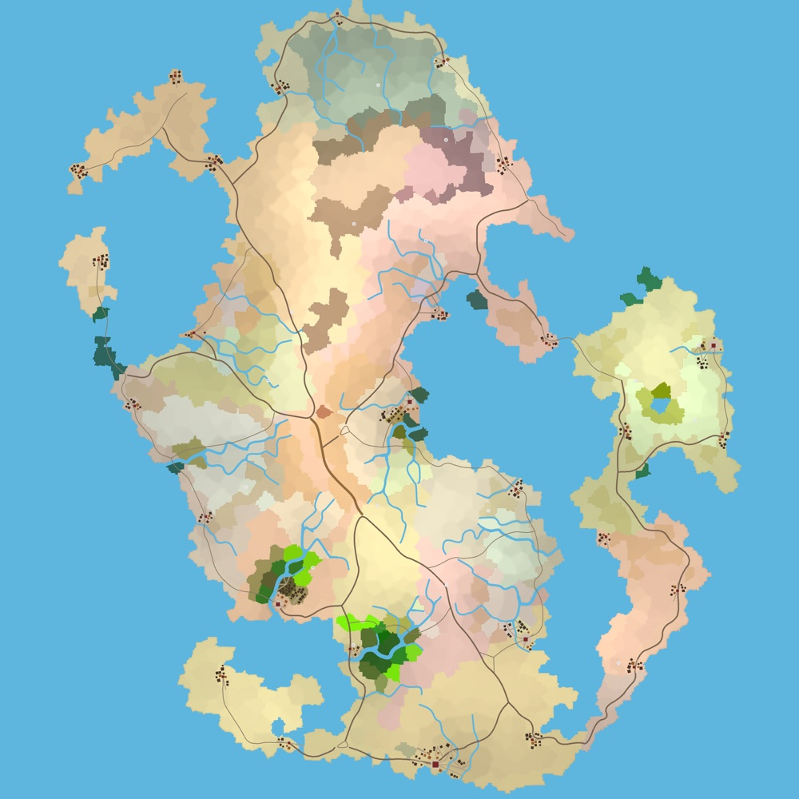
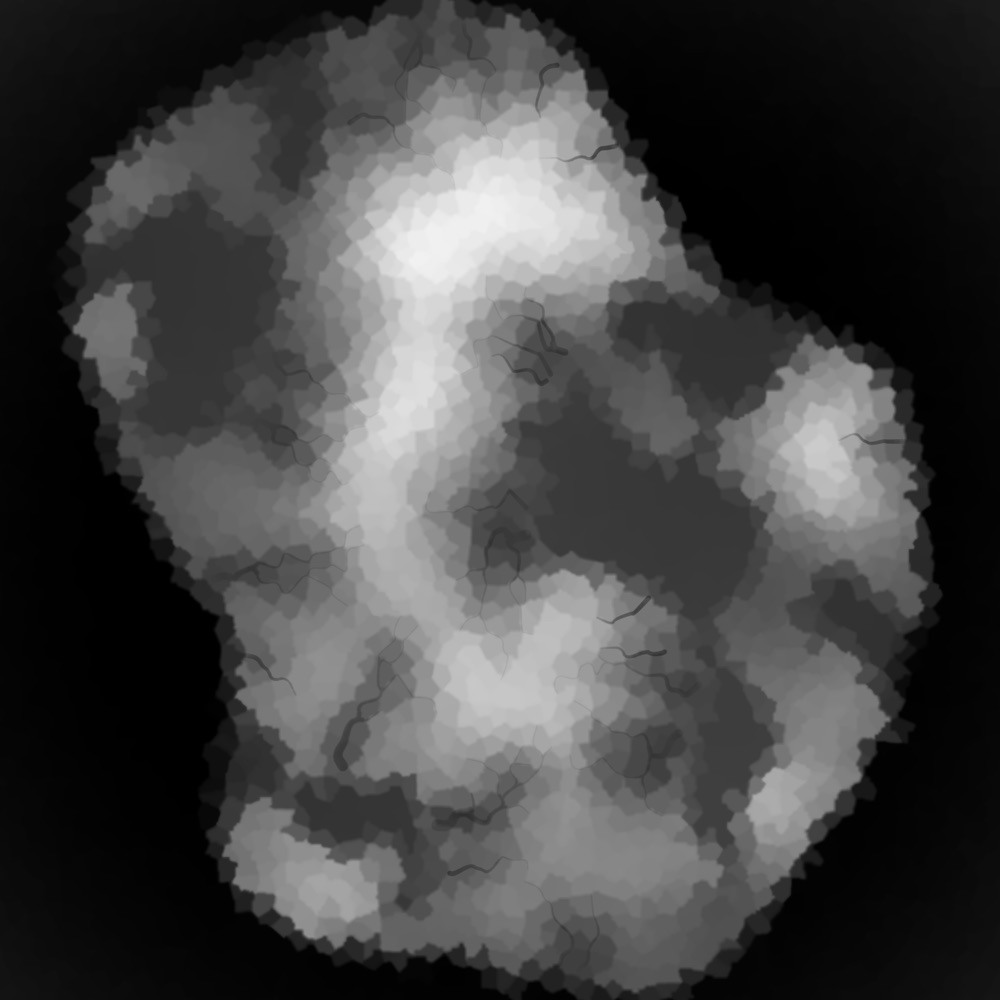
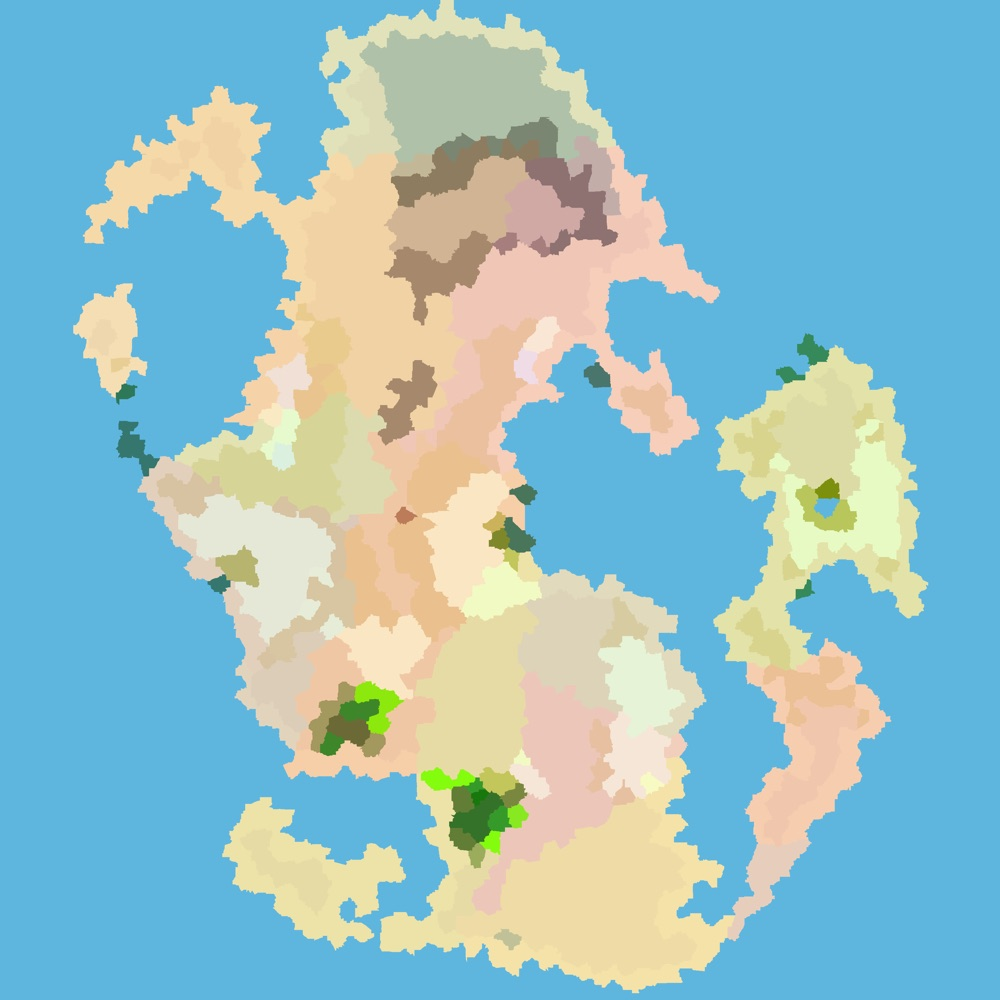
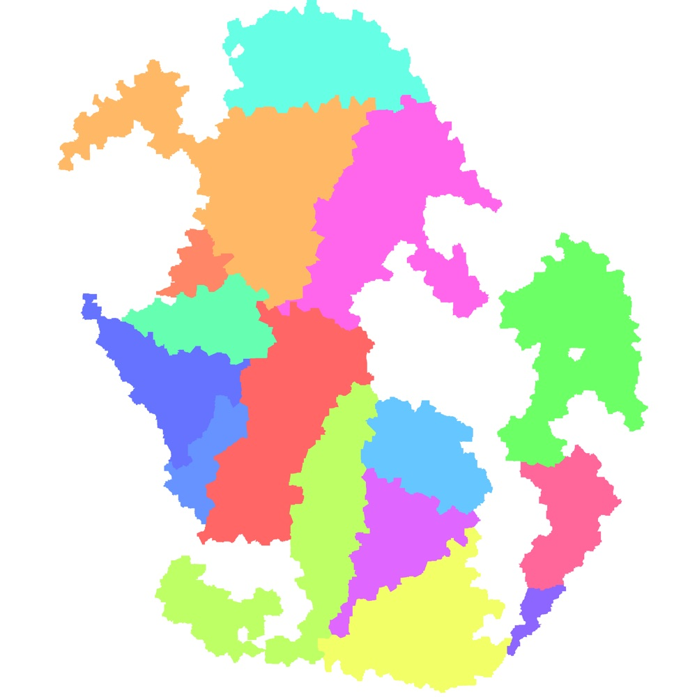
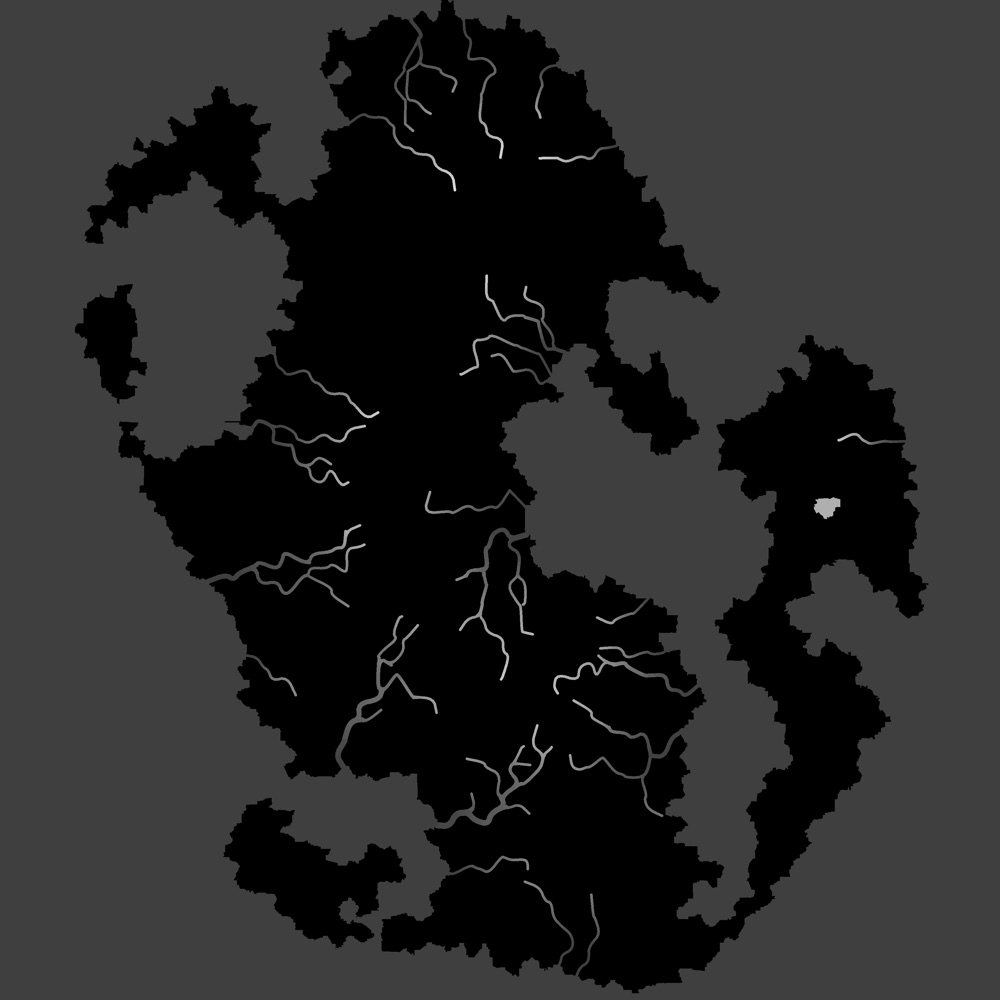
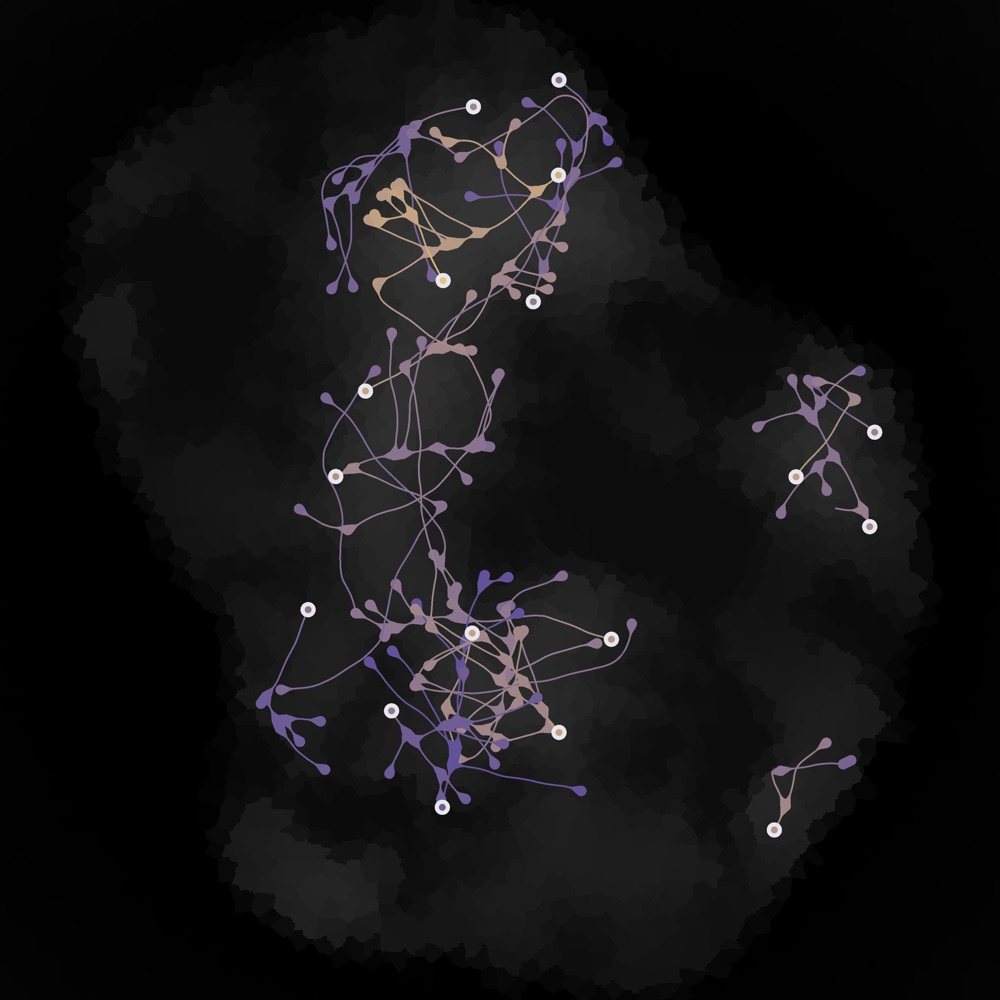
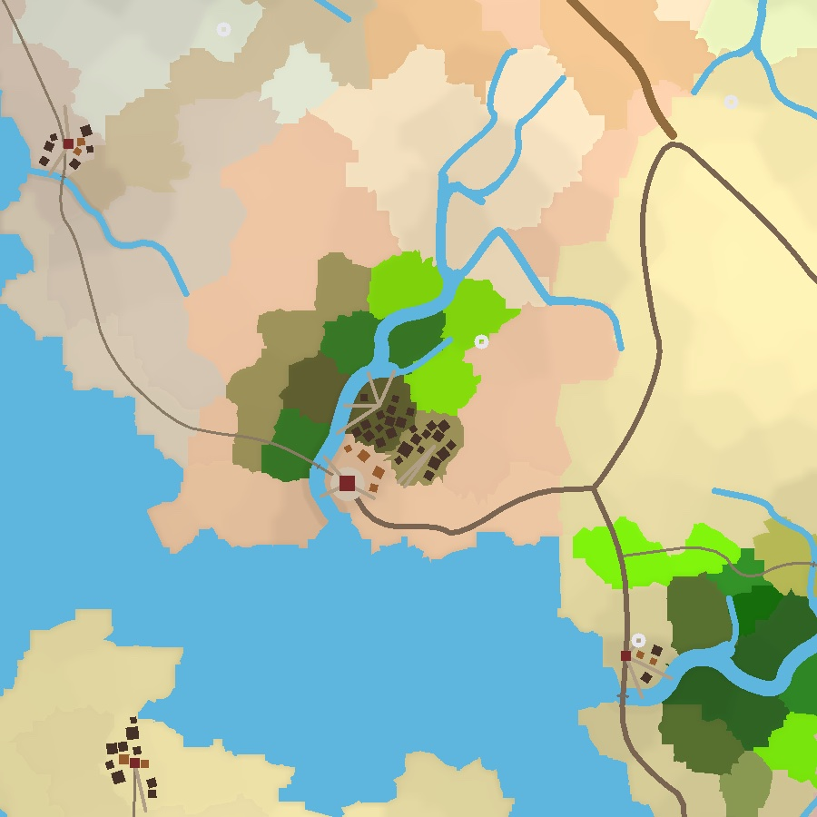
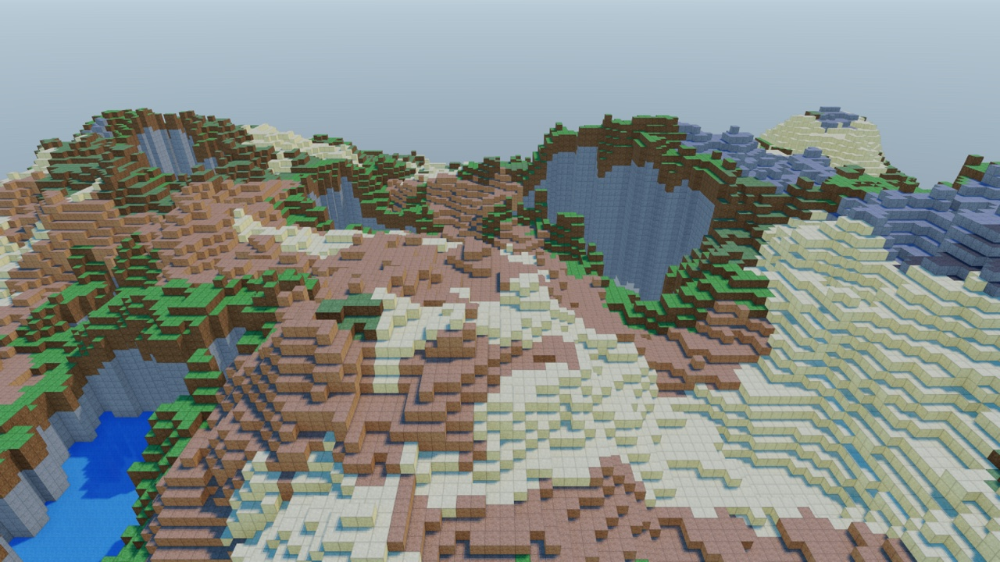

# mapcoopa

**A seeded, header-only C++20 generator for whole fantasy worlds.**

mapcoopa turns a seed and a `MapConfig` into a `MapGraph`: Voronoi cells with elevation,
climate and one of 33 biomes, rivers that run downhill to the sea, a graded road network,
nations and provinces, named settlements with streets and buildings, landmarks, and
multi-level cave systems. It produces data, not pixels. The graph saves to YAML so a game
can load a world it did not generate, and a software renderer draws nine PNG layers for
inspection. It is a port and extension of Amit Patel's
[Polygonal Map Generation](https://www.redblobgames.com/maps/mapgen2/).



<table>
  <tr>
    <td></td>
    <td></td>
    <td></td>
  </tr>
  <tr>
    <td align="center"><sub><b>elevation</b>: ground height, sea bed included</sub></td>
    <td align="center"><sub><b>biomes</b>: flat biome colour</sub></td>
    <td align="center"><sub><b>regions</b>: provinces of five nations</sub></td>
  </tr>
  <tr>
    <td></td>
    <td></td>
    <td></td>
  </tr>
  <tr>
    <td align="center"><sub><b>water</b>: sea, lake and river surface height</sub></td>
    <td align="center"><sub><b>caves</b>: systems coloured by depth</sub></td>
    <td align="center"><sub><b>close-up</b>: a settlement at 1 px per metre</sub></td>
  </tr>
</table>

All images are cropped from the `map_out_*.png` renders at the repository root, which the
`mapcoopa` tool writes with the shipped settings.

## Features

### Terrain and climate
- **Real scale.** One grid cell is 60 m, so the default map is 4.8 km square. Every
  physical size in the config is in metres, and the default render is one pixel per metre.
- **Landmass shapes.** Rectangle, circle, triangle, a single irregular continent, or an
  archipelago of landmasses that fuse when they land close together.
- **Elevation.** Distance from the coast blended with fractal relief, with a real sea
  level, a sea bed, and a vertical scale in metres (`elevation_range_m`).
- **Climate and biomes.** Temperature from latitude, altitude, noise and a global offset,
  with independent polar caps. Moisture from water and coast distance. 33 biomes from a
  three-axis Whittaker table.

### Water
- **Rivers that reach water.** Pits are filled so every river ends in a lake or the sea.
  River surfaces only fall, agree at confluences, and open into estuaries at the coast.
- **Valleys and channels.** Rivers cut a valley into the height mesh and a channel at
  their true width into the sampled surface.
- **Water as data.** `MapCenter::water_level` gives a flat surface per lake or sea, ready
  for a water mesh.

### People and places
- **Roads.** Routed between hubs and graded into trail, road and highway by the traffic
  each stretch carries, with bridges where they cross rivers.
- **Nations and provinces.** Countries split into regions, each with its own invented
  language and dialect for naming places.
- **Settlements.** Capitals, towns and villages with streets, a market square, civic
  buildings and dwellings that front the streets and stay off the roadway.
- **Landmarks.** Peaks, volcanoes, waterfalls, canyons, oases, hot springs, ruins,
  standing stones, towers, shrines and more, placed only where the terrain suits them.
- **Caves.** Multi-level systems that open on the steepest slopes, grow by vadose and
  phreatic rules, and never break the surface.

### Engineering
- **Deterministic.** A `MapConfig` and its seed fully determine the output, byte for
  byte, on Linux and macOS.
- **Header-only.** One CMake target, `coopa::maps`. No graphics dependency.
- **Async and parallel.** Optional `JobEngine` injection for background generation and
  parallel export, with output identical to a serial run.
- **Save and load.** `save_map()` / `load_map()` round-trip the whole graph and its config
  through YAML.

## Getting started

### 1. Clone

mapcoopa builds on [libcoopa](https://github.com/cooparobla/libcoopa) (logging, YAML, job
system, and through it glm and fkYAML). CMake expects libcoopa as a **sibling directory**,
`../libcoopa`:

```bash
mkdir coopa && cd coopa
git clone git@github.com:cooparobla/libcoopa.git
git clone git@github.com:cooparobla/mapcoopa.git
```

### 2. Build

You need CMake 3.20+ and a C++20 compiler.

```bash
cd mapcoopa
cmake -B build && cmake --build build -j
```

A standalone build defaults to `Release`, which matters here: the renderer is several times
slower unoptimised. This builds the `mapcoopa` tool and `mapcoopa_tests`. If `../uicoopa`
is also checked out, it builds the optional `mapcoopa_viewer` GUI too (see
[docs/viewer.md](docs/viewer.md)); pass `-DMAPCOOPA_WITH_VIEWER=OFF` to skip it.

### 3. Generate a map

```bash
./build/mapcoopa --seed=42 --out=world      # writes world.yaml and world_<layer>.png
./build/mapcoopa --shape=archipelago --shape-count=5 --out=islands
./build/mapcoopa --help                     # every flag
```

Settings come from [`assets/config.yaml`](assets/config.yaml), and flags override it for
one run. Without a seed in either, the tool picks one and prints it. A default run takes a
few seconds on a multi-core machine; nearly all of it is PNG rendering and encoding.

### 4. Use it from C++

Add the repository with `add_subdirectory()` and link `coopa::maps`. A parent project gets
only that target, with no extra executables or tests. libcoopa still has to sit beside
mapcoopa, unless your project has already defined the `coopa::lib` target.

```cmake
add_subdirectory(path/to/mapcoopa ${CMAKE_CURRENT_BINARY_DIR}/mapcoopa-build)
target_link_libraries(your_target PRIVATE coopa::maps)
```

```cpp
#include <coopa/debug/logger.h>
#include <coopa/maps/image_writer.h>
#include <coopa/maps/map_generator.h>
#include <coopa/maps/map_renderer.h>
#include <coopa/maps/map_yaml.h>

namespace maps = coopa::maps;

maps::MapConfig config;
config.seed = 42;
config.noise_island.seed = config.seed;     // noise fields have their own seeds
config.grid_size = 40;                      // 40 cells x 60 m = 2.4 km square

coopa::debug::Logger logger("worldgen");
maps::MapGenerator generator(config, logger);
generator.generate();
const maps::MapGraph& map = generator.graph();

for (const maps::MapTown& town : map.towns) {
    // Positions are in grid units; multiply by config.meters_per_grid_unit for metres.
    spawn_town(town.name, town.point.x, town.point.y, town.population, town.buildings);
}
for (const maps::MapCenter& cell : map.centers) {
    if (!cell.water) {
        place_tile(cell.point, maps::biome_name(cell.biome),
                   map.elevation_at(cell, cell.point.x, cell.point.y));
    }
}

maps::save_map(map, config, "world.yaml");
maps::write_png("world_composite.png", maps::MapLayers::composite(map, config));

maps::MapGraph loaded;
maps::MapConfig loaded_config;
maps::load_map("world.yaml", loaded, loaded_config);
```

To use the same settings file as the tool, call `maps::load_config(path, config)` before
generating. A bare `MapConfig` is smaller than the tool's default world (see
[docs/configuration.md](docs/configuration.md#how-settings-are-resolved)).

The graph holds `centers`, `corners`, `edges`, `rivers`, `roads`, `towns`, `regions`,
`countries`, `landmarks` and `caves`. Records refer to each other by index, never by
pointer. [`coopa/maps/README.md`](coopa/maps/README.md) describes each header and the data
flow.

### Used by

[toyengine](https://github.com/cooparobla/toyengine), a C++/Vulkan engine, builds streamed
3D terrain from mapcoopa worlds:



## How it works

`MapGenerator` lays a jittered point grid, triangulates it with delaunator, and reads the
Voronoi dual off the triangulation. Fourteen passes then annotate the graph in a fixed
order, each switchable with an `enable_*` key:

water, coast, elevation, temperature, rivers, valleys, moisture, biomes, roads, regions,
towns, landmarks, caves, noisy edges.

Each pass is one header in [`coopa/maps/passes/`](coopa/maps/passes/). Their inputs,
outputs and details are in [`coopa/maps/passes/README.md`](coopa/maps/passes/README.md).

## Testing

```bash
ctest --test-dir build -j8             # every suite, in parallel
ctest --test-dir build -R mapcoopa_rivers --output-on-failure   # one suite
./build/mapcoopa_tests --list          # or drive the runner directly:
./build/mapcoopa_tests --suite rivers  # one suite; a name substring selects tests
```

The tests live in [`tests/`](tests), one `<suite>_test.cpp` per system -- determinism,
the graph, climate and biomes, water, terrain, rivers and their surfaces, roads,
settlements and buildings, regions, landmarks, caves, shapes, the layer renderers,
export, the async task API, the YAML map document, configuration files, the world
scale, and the README legend. Each file is one ctest entry (`mapcoopa_<suite>`), built
into the single `mapcoopa_tests` binary on libcoopa's test framework
(`coopa/testing/test.h`). Shared fixtures are in [`tests/support/`](tests/support):
the standard configs, and a few worlds generated once per suite and read `const` --
generation is deterministic, so tests that would regenerate an identical map share it.

The suites pin invariants rather than tuning: determinism, id and range invariants,
rivers only falling and always reaching water, caves staying under the terrain, lossless
round trips, and that every parallel or banded path matches its serial one. Tests write
only to a per-test scratch directory under the system temp dir. Two read files outside
the code: one loads the shipped `assets/config.yaml`, and one checks the
[legend](#legend) below against the palette in `map_config.h`.

## Project layout

```
coopa/maps/          the library (header-only)
├── map_config.h     MapConfig, shapes, noise settings, BiomePalette
├── map_data.h       MapGraph and its records; elevation_at(), river surfaces
├── map_generator.h  MapGenerator: point set, triangulation, pass order
├── passes/          one header per generation pass
├── map_renderer.h   MapLayers: software renders of each layer
├── map_export.h     MapExporter: renders and writes all layers
├── map_yaml.h       save_map(), load_map(), load_config()
├── map_task.h       MapTask, the async handle
└── portable_random.h, portable_sort.h   cross-platform determinism
examples/            map_generator.cpp (the mapcoopa tool), map_viewer*.cpp (GUI)
assets/              config.yaml (every setting, commented), svg/ legend swatches
includes/            vendored delaunator, FastNoiseLite, stb_image_write
tools/               gen_legend_svg.py
docs/                guides; docs/images holds the screenshots above
tests/               the test suites (one <suite>_test.cpp per system), support/ fixtures
map_out.*            reference output of the shipped config (seed 42)
```

## Platform notes

- **Linux and macOS.** Both are supported with the plain CMake commands above.
- **Same seed, same world.** The C++ standard does not fix how `std::uniform_*_distribution`,
  `std::shuffle` or `std::sort` (for equal elements) behave, and libstdc++ and libc++
  differ. [`portable_random.h`](coopa/maps/portable_random.h) and
  [`portable_sort.h`](coopa/maps/portable_sort.h) reimplement libstdc++'s algorithms, and
  on Apple the target adds `-ffp-contract=off` so Clang does not fuse multiply-adds. A macOS
  build produces the same `map_out.yaml` as Linux for `--seed=42`.
- **stb_image_write.** `image_writer.h` (and `map_export.h`, which includes it) compiles
  a static copy of stb_image_write into each translation unit that includes it. A file that
  also includes another project's copy of stb_image_write will not compile, so keep the
  two apart. [`examples/map_viewer_export.h`](examples/map_viewer_export.h) explains the
  pattern the GUI viewer uses.

## Documentation

- [docs/configuration.md](docs/configuration.md): settings resolution, every CLI flag, world
  scale, landmass shapes, climate, terrain and the elevation surface.
- [docs/output.md](docs/output.md): the map file, the nine layers, shading, and meshing
  terrain and water together.
- [docs/water-and-rivers.md](docs/water-and-rivers.md): sea level, river mouths, valleys
  and channels.
- [docs/caves.md](docs/caves.md) and [docs/settlements.md](docs/settlements.md): how those
  are placed and stored.
- [docs/performance.md](docs/performance.md): async generation, timings, and checking that
  parallel output matches serial.
- [docs/viewer.md](docs/viewer.md): the optional GUI viewer.
- [coopa/maps/README.md](coopa/maps/README.md) and
  [coopa/maps/passes/README.md](coopa/maps/passes/README.md): header-by-header and
  pass-by-pass reference.
- [assets/config.yaml](assets/config.yaml): every setting with a comment.

## Legend

### Biomes

The fill colours from `BiomePalette::biome_colors` in
[`coopa/maps/map_config.h`](coopa/maps/map_config.h). The YAML name is the biome's stable
on-disk identity, accepted back by `biome_from_name()`. These rows and the swatches in
[`assets/svg/`](assets/svg) are checked against the palette by
`readme_legend_matches_the_palette` in [`tests/legend_test.cpp`](tests/legend_test.cpp).

| Colour | Biome | YAML name | Hex | RGB |
|---|---|---|---|---|
|  | Ocean | `ocean` | `#5EB6DF` | 94, 182, 223 |
|  | Lake | `lake` | `#5EB6DF` | 94, 182, 223 |
|  | Marsh | `marsh` | `#215E21` | 33, 94, 33 |
|  | Ice | `ice` | `#92CEE7` | 146, 206, 231 |
|  | Beach | `beach` | `#F5DEB3` | 245, 222, 179 |
|  | Snow | `snow` | `#FFFAFA` | 255, 250, 250 |
|  | Tundra | `tundra` | `#A9A9A9` | 169, 169, 169 |
|  | Bare | `bare` | `#C9B49B` | 201, 180, 155 |
|  | Scorched | `scorched` | `#99826D` | 153, 130, 109 |
|  | Taiga | `taiga` | `#336600` | 51, 102, 0 |
|  | Shrubland | `shrubland` | `#808000` | 128, 128, 0 |
|  | Temperate desert | `temperate_desert` | `#EED6AF` | 238, 214, 175 |
|  | Temperate rain forest | `temperate_rain_forest` | `#556B2F` | 85, 107, 47 |
|  | Temperate deciduous forest | `temperate_deciduous_forest` | `#228B22` | 34, 139, 34 |
|  | Grassland | `grassland` | `#7CFC00` | 124, 252, 0 |
|  | Tropical rain forest | `tropical_rain_forest` | `#006400` | 0, 100, 0 |
|  | Tropical seasonal forest | `tropical_seasonal_forest` | `#6B8E23` | 107, 142, 35 |
|  | Subtropical desert | `subtropical_desert` | `#FAFAD2` | 250, 250, 210 |
|  | Alpine meadow | `alpine_meadow` | `#8EBA7C` | 142, 186, 124 |
|  | Glacier | `glacier` | `#DEF1F7` | 222, 241, 247 |
|  | Cold desert | `cold_desert` | `#BAB8A0` | 186, 184, 160 |
|  | Steppe | `steppe` | `#B2B66C` | 178, 182, 108 |
|  | Savanna | `savanna` | `#C4BE5A` | 196, 190, 90 |
|  | Chaparral | `chaparral` | `#96A05C` | 150, 160, 92 |
|  | Moorland | `moorland` | `#7E7460` | 126, 116, 96 |
|  | Boreal wetland | `boreal_wetland` | `#486E60` | 72, 110, 96 |
|  | Swamp | `swamp` | `#3A5C3E` | 58, 92, 62 |
|  | Mangrove | `mangrove` | `#2E785A` | 46, 120, 90 |
|  | Cloud forest | `cloud_forest` | `#609676` | 96, 150, 118 |
|  | Badlands | `badlands` | `#B28058` | 178, 128, 88 |
|  | Salt flat | `salt_flat` | `#EEEEE6` | 238, 238, 230 |
|  | Dunes | `dunes` | `#E8CE94` | 232, 206, 148 |
|  | Volcanic field | `volcanic_field` | `#5C4A46` | 92, 74, 70 |

`ocean` and `lake` share a colour on purpose: they look like the same water, and a lake is
told apart by its shape. `ice` is a pale version of the same blue, so a river visibly ends
in water. Only these three ever colour a water cell. `marsh`, `swamp` and `boreal_wetland`
are dry land beside the water.

These are untinted, unshaded colours. With `show_regions` on (the default), each claimed
land cell is mixed 13% (`region_tint`) toward its region's colour, and the composite also
lights every land pixel. For exact matches, compare against `_biomes.png` generated with
`--no-regions` or `show_regions: false`.

### Overlays

Drawn over the filled cells in this order; each covers the one beneath it.

| Colour | Overlay | Hex | RGB | Shape |
|---|---|---|---|---|
|  | River | `#5EB6DF` | 94, 182, 223 | 5 m plus 2 m per unit of volume, along a smoothed centreline |
|  | Trail | `#887A64` | 136, 122, 100 | 3 m wide; a spur off the network |
|  | Road | `#7A6552` | 122, 101, 82 | 6 m wide |
|  | Highway | `#926C3E` | 146, 108, 62 | 10 m wide; the busiest stretches |
|  | Bridge | `#706C66` | 112, 108, 102 | Stone parapet drawn square across the road |
|  | Building | `#463228` | 70, 50, 40 | Rotated quad, 7-14 m per side, one per dwelling |
|  | Settlement | `#782828` | 120, 40, 40 | Square marker; 25 m capital, 17 m town, 11 m village |
|  | Natural landmark | `#283C82` | 40, 60, 130 | Diamond; 21 m for a region's wonder, 13 m otherwise |
|  | Built landmark | `#5A3C82` | 90, 60, 130 | Square, 13 m |
|  | Cave, shallow | `#ECC478` | 236, 196, 120 | One end of the cave overview's depth ramp |
|  | Cave, deep | `#56489C` | 86, 72, 156 | The other end. Stretched over the range of cave floors *on that map*, so two systems are comparable |
|  | Cave chamber | `#D28C60` | 210, 140, 96 | Where passages meet or a run ends |
|  | Cave mouth | `#E6E6EC` | 230, 230, 236 | Ring on the slope a system opens on |
|  | Background | `#FFFFFF` | 255, 255, 255 | Whatever no cell covers |

The three road tiers are told apart by width first and colour second. `RoadClass` comes
from `MapEdge::traffic`, the number of routes the road pass sent along that edge.
